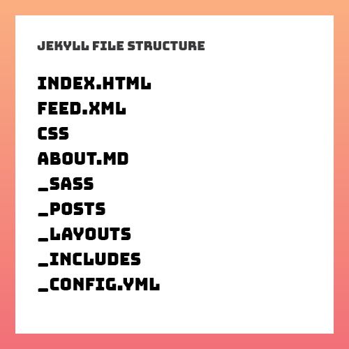

## Jekyll is a static site generator... static site generator??
Well a static site is a website that is stores its content on the page it lives on. You see we live in the year 2016, where every website seems to be built off some extremely complicated tech stack. Even simple websites are sometimes over complicated because developers want to use the latest technology available. Using the latest technology does not only increase the level of difficulty of what should be otherwise quite simple but it often increases the load time of your webpage due to the inclusion of extra network requests.

The rise of complexity in basic websites has sparked a new revolution. Well not really that dramatic but developers are pissed off that creating something like a blog in 2016 isn’t easier. This is where static site generators have gained its share in the market place. Static site generators provide developers with a simple solution that uses a low barrier of entry. Most popular of them being <a href="https://jekyllrb.com/" target="_blank">Jekyll</a>.

Jekyll provides you with the tools to create a full fledged blog thats static. This provides us with a couple benefits right off the bat. One of them being that we don’t have to rely on a database. Quick History Lesson: For blogs, its common to store the content of a blog post within a database. This means we rely on the database to send information to users each time they reach a webpage. But if you want a simple blog than Jekyll could be a preferred solution. Jekyll lets you write in markdown and it produces a static web page in a blog friendly manner using a tempting language called liquid. With a static webpage. We don’t have to wait for the database to send us back data, making the web page faster. Its a more simple, retro way of making a blog but its great because it really strips out the unnecessary code and the reliance on a database is dissolved.

## Prereqs!

### HTML, CSS, SASS, Markdown

Jekyll is really easy to get started with. But there are some prerequisites. If you have a solid grasp of the above you can easily create a fully functional static blog! You don’t technically need to know Sass but the example project we will work with includes Sass by default. You do need to work in the terminal a bit but it should be very minimal.

## Let get Started
Before we get started you need to have Ruby installed onto your computer. Once installed, we need to download Jekyll. We do this by going to our CLI of choice, I use <a href="https://hyper.is/" target="_blank">Hyper</a>. In our CLI we will install Jekyll by typing the following <i class="code-term">ruby command gem install jekyll bundler</i>.
We know have Jekyll installed on our computer and we can create a Jekyll project. Note the difference the command that we ran in our CLI installed Jekyll which gives us the ability to create projects. It is not actually creating a Jekyll project. To that we will run a different command. First in your CLI we will navigate to a directory where we want to start our Jekyll project. If you haven’t already, lets navigate to the documents directory of your computer using the CLI. When you open your terminal your typically at the root of your account on the computer. Knowing this we can go to the documents directory by typing <i class="code-term">cd documents</i> into your CLI. We should now be in the documents directory and we can create our Jekyll project in here. Back in your CLI, type the following command <i class="code-term">jekyll new name-your-project</i>

Sweet! We have our project created and now we can begin creating! If you know me I ❤ creating. Lets take a look at our Jekyll Project from a high level.

## _config.yml
This is a YAML file. In this file we can assign variables a value that will be reused often throughout our site. In our html files we can use the variables as an easy way to reference the values we set. You will see a better explanation of this later as we go through the rest of the file structure.

## Front Matter
Front matter is not a new element found by some scientist in Switzerland. It’s actually what makes Jekyll so cool. When Jekyll reads a page with Front Matter, it will know its a unique page. Front Matter is defined by placing three dashes at the beginning of your file and ended with three dashes on a new line. Between those line two lines we can set values to variables that will tell Jekyll to do specific things with the particular markdown file. 

---
layout: post
title:  "Welcome to Jekyll!"
date:   2016-10-11 21:20:18 -0700
categories: jekyll update
---


There are predefined variables already created by Jekyll like layout, title, and permalink to name a few. You can also create your own variables that take a value that you give it. We will see in the next pages how Front Matter comes in handy.

## index.html
This is not your regular index.html. Jekyll’s index.html provides you with a boilerplate home page for your blog. It is using Jekyll’s unique encoding to spit out a li for every post that you have created. Since this a new project with no new post it is only showing the one post that Jekyll has provided as a boilerplate post. Notice how the anchor element is pulling the baseurl that is set in _config.yml.

## about.md
This is a markdown file with a few Jekyll enhancements. At the top of the file we see the variables of layout, title, and permalink being assigned values. Below that, there is basic markdown style text. When Jekyll views this markdown it creates a unique html page out of it with the markdown provides and it uses the values we set at the top to define the layout the html page should use, the title of the html page and the link of the page. This will create an about page and we can copy this markdown file to create the a new page

## feed.xml
The feed.xml is an xml file that pulls data defined throughout our Jekyll project to create a search engine friendly xml sheet. I would avoid touching this file unless you want to make some adjustments to it but Jekyll provides a greate feed.xml by default.

## _includes
The _includes directory houses bits of code that will be reusable throughout our site. These reusable pieces of code are injected onto whichever page its called in. Working very similarly to php includes. Good includes to have handy are header and footer because they are sections of code that are reused often. We will see how they work in the upcoming section.

## _layouts
The _layouts directory stores templates for our md pages to use. We currently have three built-in templates but we can have as many as want. Lets open up default.html. You can see the file starts as a typical html page would start. Within the html element we see a couple includes. head.html, header.html, and footer.html are being injected into this page. The content is where the generated html of the markdown file using this layout will be placed. If we take a look again at our about.md file, it specifies which layout to use by having the values of page assigned. When Jekyll creates a html page out of this markdown file, it will know to use the page layout and to dump the markdown wherever content is called in the page layout.

## _posts
The _posts directory will be where we place our blog post! If we open the template blog post that comes with a new Jekyll project we will notice it works similar to how the about.md works. The front matter now contains title, date, and categories. These are useful variables that enhance your posts. By default this post is using the post layout. If we look at the post.html layout within the _layouts directory the template is setup to layout our content within the div with a class of post_content. Also notice the chunk of ruby code within the post. This is placed to show an example of how to write code examples within your code.

## _sass
If you haven’t worked with sass I suggest you take a look at my previous post where I can into detail how to use Sass. At a high level, Sass is a CSS extension that lets you do things regular css wouldn’t do. Jekyll provides you with basic Sass files that style your Jekyll project. You can go into the sass files and start writing some css to make your blog unique.

## _site
Now we have arrived to the final directory. _site actually stores your blog as its viewed in a browser. When Jekyll goes through all of your markdown files and posts within the _posts directory it generates html pages for each of them and places them is the _site directory. Lets view our project in a browser. Let go back into our cli and type in <i class="code-term">jekyll serve</i>. This will create a local server that we can use to view our blog. After running that command Jekyll will spit out a url that you can navigate to. The one it gave me is <a href="http://127.0.0.1:4000/" target="_blank">http://127.0.0.1:4000/</a> If you open that link in a browser we will see our Jekyll project! This is actually the html pages that are within the _site directory. If you wanted to host this project on a website you would just grab everything within the _site directory and place that in the directory your website starts at.

## Take Aways
There might be a lot of new terms and concepts that were introduced to you but the barrier of entry to this type of setup is much smaller than a Wordpress site or a website that uses a bunch of different technologies. A key idea I want to pass with this tutorial is that we don’t need to overcomplicate things. If you have to complete a task, we should look for a way to complete it to the best of our abilities. Once there is a need for certain functionality that is provided by some other type of tech we can try to integrate it then but not anytime sooner.